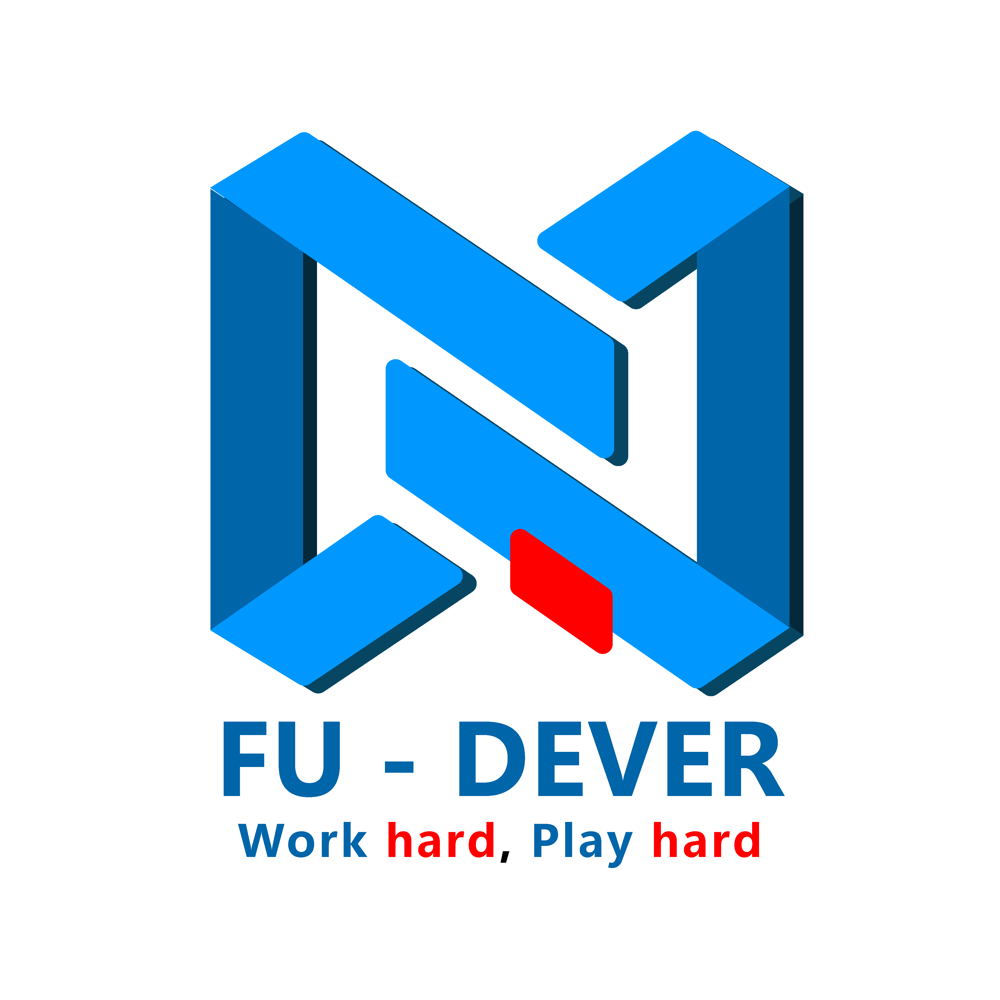
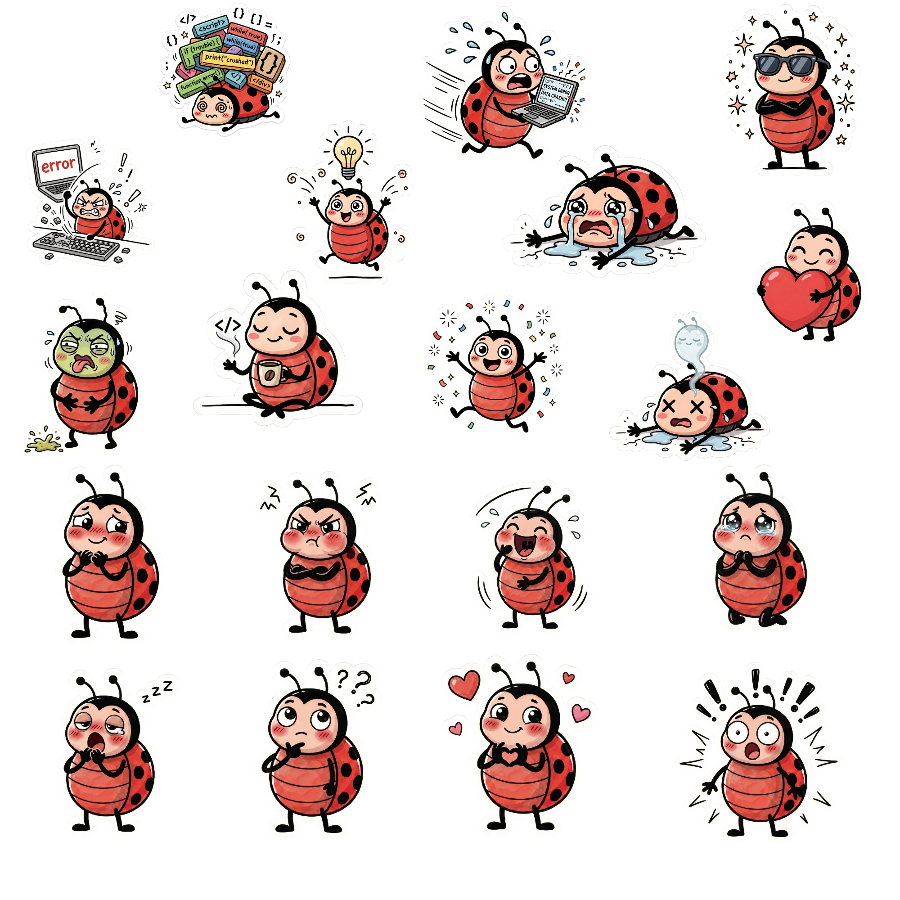
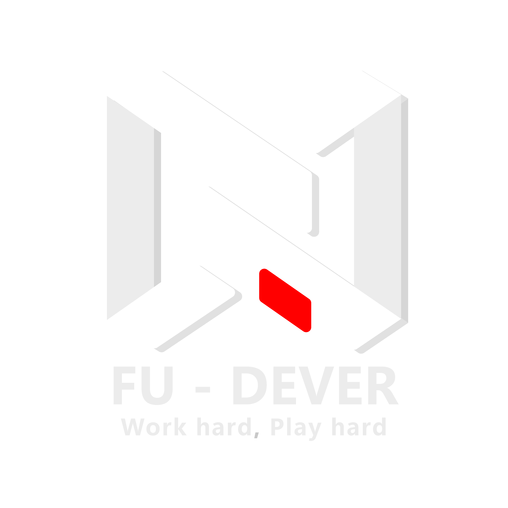

<div align="center">

  

  # 🎯 PROMPT CHALLENGE
  ### Nền tảng Thi Đấu Prompt AI Đối Kháng Real-time

  **Một sản phẩm công nghệ sáng tạo được phát triển bởi [CLB Lập trình FU-DEVER](https://fudever.club) — Trường Đại học FPT Đà Nẵng.**

  [](https://facebook.com/fudever.club)
  [](https://dnuni.fpt.edu.vn)
  [](https://nodejs.org)
  [](https://socket.io)
  [](https://deepmind.google/technologies/gemini/)
  [](https://supabase.com)
  [](https://prompt-challenge-nine.vercel.app)
  [](LICENSE)

  <br/>

  <p align="center">
    <a href="#-giới-thiệu-tổng-quan">Giới Thiệu</a> •
    <a href="#-tính-năng-nổi-bật">Tính Năng</a> •
    <a href="#-kiến-trúc-hệ-thống">Kiến Trúc</a> •
    <a href="#-hướng-dẫn-cài-đặt">Cài Đặt</a> •
    <a href="#-vận-hành-tại-gian-hàng-club-day">Vận Hành Booth</a> •
    <a href="#-triển-khai-production">Triển Khai Cloud</a> •
    <a href="#-về-fu-dever">Về FU-DEVER</a>
  </p>

  
</div>

---

## 📖 Giới Thiệu Tổng Quan

**Prompt Challenge** là web app thi đấu trí tuệ đối kháng theo thời gian thực (real-time) lấy cảm hứng từ làn sóng sáng tạo nội dung AI thế hệ mới. Được thiết kế chuyên biệt cho **Club Day**, ngày hội công nghệ, triển lãm AI và các sự kiện nội bộ của **FU-DEVER**, ứng dụng biến việc "viết prompt" thành một trò chơi đối kháng trực tiếp đầy hào hứng, trực quan và chuyên nghiệp.

Hai đội thi quan sát ảnh mẫu gốc (reference image) trong thời gian giới hạn, sau đó sử dụng tư duy ngôn ngữ và kỹ thuật Prompt Engineering để tái tạo lại bức ảnh đó qua các mô hình Generative AI tân tiến. Giám khảo AI đa phương thức (**Multimodal AI Judge**) sẽ phân tích ngữ cảnh, bố cục, màu sắc và chấm điểm khách quan kèm lời nhận xét chi tiết.

---

## ✨ Tính Năng Nổi Bật

### 1. Đồng Bộ Real-time 4 Màn Hình Chuyên Biệt
- **Trung Tâm Điều Hướng (Hub - `/`):** Cổng kết nối trung tâm với giao diện Cyberpunk sang trọng, cung cấp đường link nhanh cho người chơi và ban tổ chức.
- **Bàn Quản Trị Trung Tâm (Admin Console - `/admin.html`):** Bảo vệ bằng mã PIN bảo mật, quản lý vòng đấu, cấu hình thời gian, chọn ảnh đề bài từ Cloud hoặc tải ảnh mới, chấm điểm cưỡng bức khi cần, và quản lý bảng xếp hạng.
- **Đấu Trường Đội Thi (Team Consoles - `/team.html?team=A` & `?team=B`):** Tối ưu cho thiết bị di động/tablet, phản hồi xúc giác (tactile feedback), các mẫu prompt 1-chạm, đếm ngược đồng bộ và thông báo tức thì.
- **Màn Hình Trình Chiếu Khán Giả (Spectator TV - `/display.html`):** Thiết kế cho máy chiếu và màn hình TV lớn độ phân giải cao; hiển thị đối đầu song song, đồng hồ đếm ngược kịch tính và hiệu ứng vinh danh người chiến thắng.

### 2. Giám Khảo Đa Phương Thức AI & Cơ Chế Chịu Lỗi 3 Tầng
- **Tự động sinh ảnh song song:** Hỗ trợ mô hình tạo ảnh AI hiện đại kết hợp cơ chế giãn cách gọi API (staggering 300–400ms) chống nghẽn và chống chạm ngưỡng rate-limit.
- **Cơ chế Fallback 3 tầng thông minh:**
  1. *Tầng 1:* Google Gemini 2.5 Flash Image / Imagen 3.
  2. *Tầng 2:* OpenAI DALL-E.
  3. *Tầng 3:* SVG Canvas Dynamic Render — đảm bảo cuộc thi không bao giờ bị dừng giữa chừng.
- **Giám khảo Gemini 2.5 Flash Multimodal:** Chấm điểm theo thang điểm 5 sao, so sánh ngữ nghĩa, độ tương đồng phong cách và xuất lời giải thích bằng tiếng Việt tự nhiên.

### 3. Lưu Trữ Đám Mây Supabase Storage & Mạng Cục Bộ Tự Động
- Tích hợp **Supabase Storage** (Bucket `gallery`) lưu trữ đề bài sắc nét trên Cloud, có dự phòng lưu trữ đĩa cục bộ và bộ nhớ RAM cho serverless.
- Tự động nhận diện địa chỉ IP mạng nội bộ (LAN IP) và sinh **Mã QR phóng to 1-chạm** giúp tablet/điện thoại quét mã vào thi đấu ngay lập tức mà không cần gõ URL.

### 4. Tiêu Chuẩn Thiết Kế Impeccable (Operate & Persuade)
- Chế độ nền tối (Dark mode) với phong cách công nghệ cao, phối màu Emerald Green & Cyber Neon của thương hiệu FU-DEVER.
- Đảm bảo an toàn thông tin: **100% không để lộ mật khẩu trần trụi** trên UI, mã nguồn hay API response.

---

## 🏗 Kiến Trúc Hệ Thống

```mermaid
sequenceDiagram
    autonumber
    actor Admin as 👨‍💼 Ban Tổ Chức (Admin)
    actor TeamA as 🔴 Đội Thi A (Tablet)
    actor TeamB as 🔵 Đội Thi B (Tablet)
    actor TV as 📺 TV Màn Hình Khán Giả
    participant Server as ⚙️ Node.js Socket.io Server
    participant Storage as 🗄️ Supabase Storage
    participant AI as 🤖 Gemini 2.5 / OpenAI AI Engine

    Admin->>Server: Đăng nhập PIN & Chọn ảnh đề bài (Gallery/Upload)
    Server->>Storage: Nạp URL ảnh đề bài
    Admin->>Server: Kích hoạt pha xem ảnh [VIEWING]
    Server-->>TeamA: Đồng bộ ảnh đề bài + Đếm ngược (10s)
    Server-->>TeamB: Đồng bộ ảnh đề bài + Đếm ngược (10s)
    Server-->>TV: Phát ảnh đề bài lên màn hình lớn

    Note over TeamA,TeamB: Hết giờ xem đề -> Chuyển sang pha [PROMPTING]
    TeamA->>Server: Nộp Prompt Đội A
    TeamB->>Server: Nộp Prompt Đội B

    rect rgb(20, 30, 50)
    Note over Server,AI: Cả 2 đội nộp xong -> Tự động xử lý AI
    Server->>AI: Sinh ảnh Đội A & Đội B (Staggered Call)
    AI-->>Server: Trả về ảnh AI của 2 đội
    Server->>AI: Giám khảo Gemini phân tích & chấm điểm tương đồng
    AI-->>Server: Trả về Điểm số + Lời nhận xét
    end

    Server-->>TV: Trình chiếu 2 ảnh AI + Chấm điểm + Vinh danh thắng cuộc
    Server-->>TeamA: Hiển thị kết quả, điểm số & lý do giám khảo
    Server-->>TeamB: Hiển thị kết quả, điểm số & lý do giám khảo
    Server-->>Admin: Cập nhật Bảng xếp hạng tích lũy
```



---

## 📂 Cấu Trúc Mã Nguồn

```text
prompt-challenge/
├── .env.example              # Mẫu biến môi trường bảo mật
├── .gitignore                # Danh sách loại trừ Git
├── package.json              # Khai báo dependencies và scripts
├── server.js                 # Backend Node.js, Socket.io, Gemini AI & Supabase
├── supabase_setup.sql        # Kịch bản SQL cấu hình Supabase Bucket & Policies
├── test_e2e_flow.js          # Bộ kiểm thử tự động End-to-End toàn diện
├── vercel.json               # Cấu hình triển khai đám mây Vercel
└── public/                   # Frontend tĩnh phục vụ người dùng
    ├── index.html            # Cổng điều hướng trung tâm (Hub)
    ├── admin.html            # Bàn điều khiển quản trị viên (Admin Station)
    ├── team.html             # Đấu trường nhập prompt dành cho 2 đội thi
    ├── display.html          # Màn hình trình chiếu khán giả (Spectator Display)
    ├── btc.html              # Bàn điều khiển phụ dành cho trọng tài
    ├── style.css             # Hệ thống CSS Design Token Impeccable
    ├── qrcode.min.js         # Thư viện sinh mã QR LAN tự động
    └── assets/               # Thư viện ảnh, mascot Buggy & logo chính thức
        ├── logo-dever-color.png
        ├── logo-dever-white.png
        ├── logo-fptu.png
        ├── buggy-welcome.png
        ├── buggy-cheer.png
        ├── buggy-thinking.png
        └── samples/          # Thư viện ảnh đề bài mẫu có sẵn
```

---

## 🚀 Hướng Dẫn Cài Đặt

### Yêu cầu tiên quyết
- **Node.js**: Phiên bản `18.0.0` trở lên.
- **Tài khoản API**:
  - Google AI Studio API Key (dành cho Gemini 2.5 Flash và Imagen).
  - *(Tùy chọn)* OpenAI API Key (dành cho DALL-E dự phòng).
  - *(Tùy chọn)* Supabase Project URL & Service Role Key (để dùng Cloud Storage).

### Các bước cài đặt

1. **Clone repository:**
   ```bash
   git clone https://github.com/fudever-club/prompt-challenge.git
   cd prompt-challenge
   ```

2. **Cài đặt thư viện dependencies:**
   ```bash
   npm install
   ```

3. **Cấu hình biến môi trường:**
   Sao chép `.env.example` thành `.env`:
   ```bash
   cp .env.example .env
   ```
   Cập nhật các thông số quan trọng trong `.env`:
   ```env
   # API Keys
   GEMINI_API_KEY=AIzaSy...
   OPENAI_API_KEY=sk-...

   # Supabase Storage (Ưu tiên dùng Service Role Key để nạp ảnh mượt mà)
   NEXT_PUBLIC_SUPABASE_URL=https://your-project.supabase.co
   SUPABASE_SERVICE_ROLE_KEY=eyJhbGciOi...

   # Mật khẩu quản trị Admin Console (tùy chọn)
   ADMIN_PASSWORD=your_secret_admin_password

   # Cổng mạng (Mặc định 3000)
   PORT=3000
   ```

4. **Khởi chạy ứng dụng:**
   ```bash
   npm start
   ```
   Hệ thống sẽ khởi động và cung cấp đường dẫn truy cập:
   ```text
   🚀 Server đang chạy tại: http://localhost:3000
   📡 Mạng LAN:              http://192.168.1.15:3000
   🔑 Mật khẩu Admin:        [ĐÃ BẢO MẬT]
   ```

---

## 🎪 Vận Hành Tại Gian Hàng Club Day

Để trận đấu diễn ra chuyên nghiệp, trơn tru tại sự kiện offline:

### 1. Chuẩn Bị Thiết Bị
- **1 Laptop Server (BTC):** Cắm nguồn liên tục, kết nối mạng WiFi sự kiện hoặc mạng 4G/5G phát từ điện thoại, mở trình duyệt vào `/admin.html`.
- **2 Tablet/Điện Thoại:** Kết nối cùng mạng WiFi với laptop, quét mã QR trên màn hình Admin để vào `/team.html?team=A` và `/team.html?team=B`.
- **1 Màn Hình Lớn / TV / Máy Chiếu:** Kết nối HDMI từ laptop thứ 2 hoặc mở trình duyệt vào `/display.html`.

### 2. Quy Trình Vận Hành Một Lượt Đấu (Game Flow)
1. **Thiết lập:** Quản trị viên nhập tên 2 đội tham gia (ví dụ: *SE1801* vs *IA1802*) và chọn ảnh đề bài từ thư viện ảnh.
2. **Bắt đầu (Pha 1 - Xem đề):** Nhấn **"Bắt đầu vòng (Xem ảnh)"**. Cả 3 màn hình hiển thị ảnh đề bài cùng đồng hồ đếm ngược (mặc định 10s).
3. **Soạn Prompt (Pha 2 - Nhập liệu):** Hết giờ xem đề, hệ thống tự động giấu ảnh đề bài. Hai đội tập trung tư duy và gõ prompt mô tả chi tiết hình ảnh.
4. **Xử lý AI (Pha 3 - Vẽ ảnh & Chấm điểm):** Khi cả 2 đội bấm **Nộp Prompt**, hệ thống tự động kích hoạt tiến trình tạo ảnh AI song song và chuyển giao cho giám khảo Gemini chấm điểm.
5. **Vinh danh:** Điểm số từ 1 đến 5 sao cùng lời nhận xét sắc bén của AI được hiển thị nổi bật trên màn hình TV kèm hiệu ứng pháo hoa chúc mừng.
6. **Lượt tiếp theo:** Nhấn **"Reset vòng đấu"** và bắt đầu lượt chơi mới cho các đội tiếp theo!

---

## ☁️ Triển Khai Production

### Triển khai trên Vercel
Dự án đã được cấu hình sẵn cho **Vercel Serverless Architecture** thông qua file `vercel.json`:
- Đẩy code lên GitHub repository.
- Kết nối repository với tài khoản Vercel.
- Cấu hình các Environment Variables (`GEMINI_API_KEY`, `SUPABASE_SERVICE_ROLE_KEY`, `ADMIN_PASSWORD`...) trên Vercel Dashboard.
- Nhấn **Deploy** — Vercel sẽ tự động build và cấp phát domain HTTPS tốc độ cao.
- **Bản Live Demo chính thức:** [prompt-challenge-nine.vercel.app](https://prompt-challenge-nine.vercel.app)

### Cấu hình Supabase Storage
Để tạo kho lưu trữ ảnh trực tuyến, chạy script [supabase_setup.sql](supabase_setup.sql) trong **SQL Editor** của Supabase Dashboard. Bucket `gallery` sẽ được khởi tạo tự động ở chế độ Public.

---

## 🧪 Kiểm Thử Tự Động & Đảm Bảo Chất Lượng

Hệ thống được trang bị bộ kiểm thử tự động toàn diện [test_e2e_flow.js](test_e2e_flow.js) bao quát 100% các chức năng cốt lõi:

```bash
# Chạy bộ test E2E kiểm tra toàn bộ luồng
node test_e2e_flow.js
```

### Kết quả kiểm định chất lượng:
```text
===========================================================
🏁 KẾT QUẢ KIỂM THỬ TỰ ĐỘNG: 23 PASS, 0 FAIL
===========================================================
✅ [PASS] Tất cả tài nguyên ảnh hệ thống & linh vật Buggy khả dụng
✅ [PASS] Kết nối Supabase Storage & Upload ảnh công khai
✅ [PASS] Bảo mật xác thực Admin Console & Mã hóa mật khẩu
✅ [PASS] Điều phối trạng thái vòng đời trận đấu (Idle -> Viewing -> Prompting -> Judging)
✅ [PASS] AI sinh ảnh song song & Chấm điểm Gemini 2.5 Flash
✅ [PASS] Kiểm thử Playwright đa trình duyệt trên cả 5 giao diện
```

---

## 👥 Về FU-DEVER

<div align="center">
  
  <br/><br/>
  <p><strong>CLB Lập Trình & Kỹ Thuật Phần Mềm FU-DEVER — Trường Đại học FPT Đà Nẵng</strong></p>
  <p><i>"Code for Passion — Build for Future"</i></p>
  <p>Được thành lập từ năm 2016, FU-DEVER là một trong những câu lạc bộ học thuật công nghệ hàng đầu tại Đại học FPT Đà Nẵng, nơi quy tụ các sinh viên đam mê Kỹ thuật Phần mềm, Trí tuệ Nhân tạo, Phát triển Web, Mobile và Game.</p>
  
  <p>
    🌐 <strong>Website:</strong> <a href="https://fudever.club">fudever.club</a> &nbsp;|&nbsp;
    📘 <strong>Fanpage:</strong> <a href="https://facebook.com/fudever.club">facebook.com/fudever.club</a> &nbsp;|&nbsp;
    🐙 <strong>GitHub:</strong> <a href="https://github.com/fudever-club">github.com/fudever-club</a>
  </p>
</div>

---

## 📄 Bản Quyền (License)

Dự án được phát hành theo giấy phép mã nguồn mở [MIT License](LICENSE). Được bảo trợ và phát triển bởi **FU-DEVER Club**.
